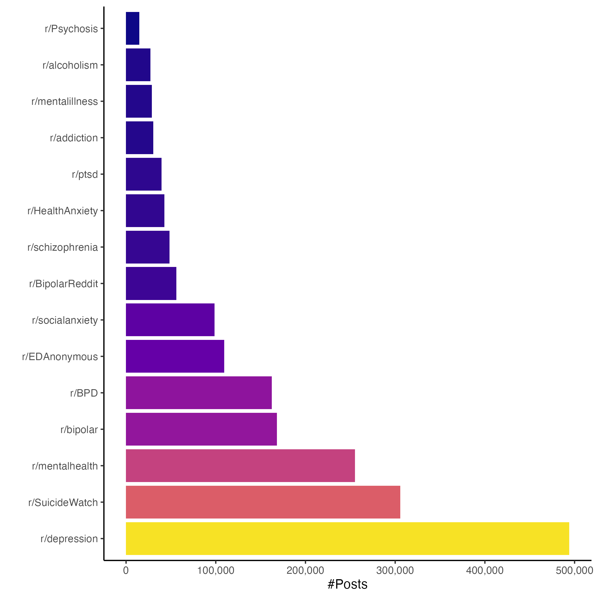
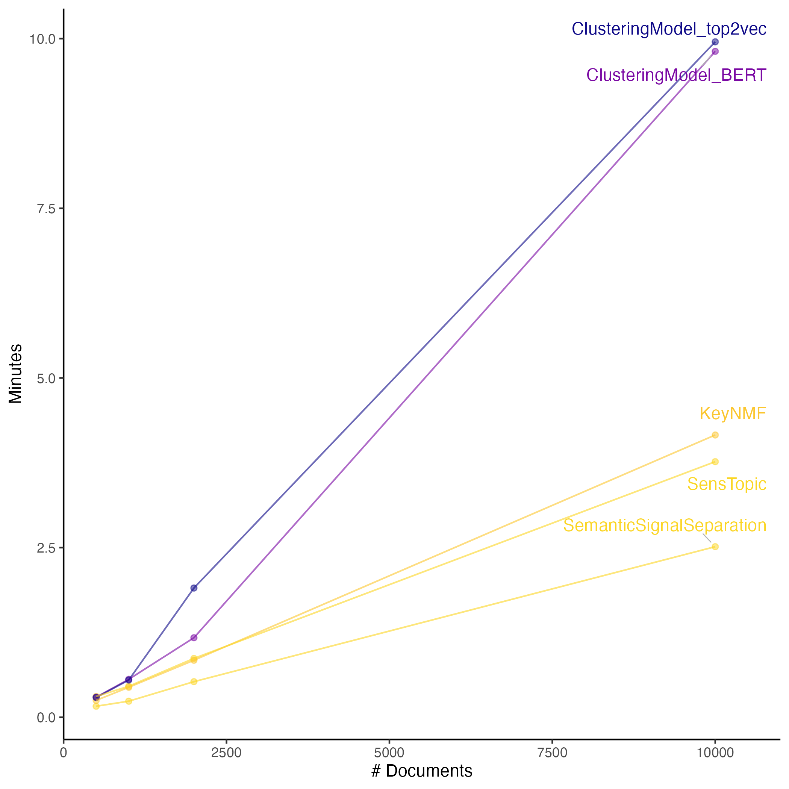
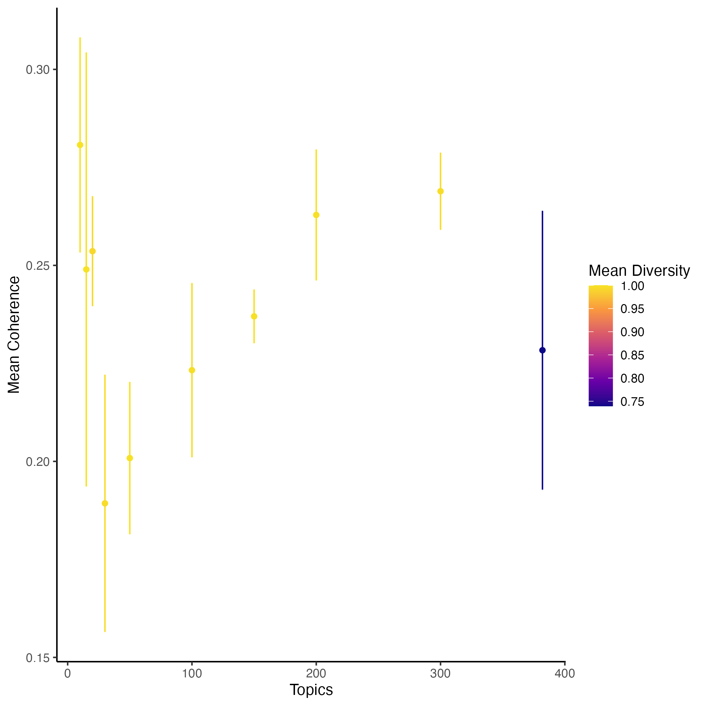

\begin{titlepage}
\centering
\vspace*{2cm}

{\LARGE\bfseries Text-mining Reddit Mental Health Posts to Advance Research in Psychopathology\par}
\vspace{1.5cm}

{\large Emil Frej Brunbjerg (202105405)\par}
\vspace{0.75cm}

{\large Aarhus University\par}
\vspace{0.25cm}

{\large Natural Language Processing (MSc. Cognitive Science)\par}
\vspace{1.5cm}

{\large \today\par}

\vfill
\end{titlepage}
\newpage
\tableofcontents
\newpage

```{r setup, include=FALSE}
knitr::opts_chunk$set(echo = FALSE, message = FALSE, warning = FALSE, out.width = "80%", fig.align = "center")
library(tidyverse)
library(knitr)
library(kableExtra)
```

# Contribution of the Present Project

Diagnostic manuals have become the de-facto scientific paradigm of
psychopathology, yet there is an ever-growing list of empirical
inconsistencies heralding a need for new foundational theories. Multiple
frameworks and research programs have spurred from this situation
[@eatonReviewApproachesModels2023a]. The present project attempts to
help this development underway Text-mining a large corpus of mental
health related posts from the social media platform Reddit. Assuming
that online language has some correspondence with lived psychopathology,
the resulting data set has a number of desired qualities for
psychopathological research; it is vast, longitudinal, and arguably
ecological (considering its free-text nature). The goal of the present
project to overcome computational hurdles of topic modeling nearly two
million Reddit posts so that researchers interested in nosological
(relating to classification) and etiological (causal) questions of
psychopathology can benefit from the vast library of free text by easing
the required data scientific skills.

```{r, fig.cap= "Sketch of the pipeline used for the present project."}
knitr::include_graphics("figures/figure1.png")
```

The produced data comes with several important limitations (see section
6). Specifically, it contains document topic weights for all documents
and term importances for the entire vocabulary. Alongside this, a
metadata file containing the origin subreddit of each document, posting
time, and anonymised author-ids is provided, which in theory could be
used to investigate individual changes through time. Additionally, a
Jupyter notebook is included as an example of how to manipulate the
resulting data set. Code for the entire pipeline is published to
Github\footnote{Link: \url{https://github.com/emilfrej/Reddit4MentalHealthResearch}}
and the resulting data set, which stripped of original posts and with
anonymised user-ids, is published as compressed file on a shared
drive\footnote{Link:
\url{https://www.dropbox.com/scl/fo/7pkofmtii9oflsi21dv0b/AHOwC3Q2lyBe2_hhvFqhhYI?rlkey=51u8ni3cxtowrp1v3chh7jh07&st=jrt3je13&dl=0}}.

# Problems with Using Diagnostic Manuals as a Scientific Paradigm

The Diagnostic and Statistical Manual of Mental Disorders (DSM) is the
dominant nosological and etiological system in research on mental
health. Alongside the International Classification of Diseases, it
functions as a central reference not only for clinicians but also for
researchers. [@eatonReviewApproachesModels2023a] However, an increasing
number of scholars have raised concerns that the paradigm implicit to
the diagnostic manuals is fundamentally flawed. For example, a major
criticism of the standard nosology is its commitment to categorical
diagnosis, i.e., judging that a disorder is present or not. Early
evidence suggested that higher-quality research tended to favor
dimensional explanations of psychopathology over categorical ones
[@haslamCategoriesDimensionsPersonality2012b] and recent meta-analytic
estimates of fit indices have provided strong support for the view that
most forms of psychopathology are continuous rather than categorical
[@haslamDimensionsCategoriesMetaanalysis2020].

While adapting the disease entities for the fifth edition of the DSM was
proposed [@narrowDimensionalApproachesPsychiatric2011], inconsistencies
with empirically derived nosology would still remain. For example, the
frequency of receiving an MDD diagnosis given a GAD diagnosis is above
50%, while the US population frequency of MDD is approximately 13%
[@millonContemporaryDirectionsPsychopathology2010b]. To map comorbidity
at the symptom level, @forbesReconstructingPsychopathologyDataDriven2025
surveyed 14762 participants, asking what DSM symptoms participants
experienced within the past year. While some DSM disease entities
remained aligned with empirically derived clustering of the resulting
data, multiple others, notably including Major Depressive Disorder,
disappeared.

## Recent Advancements in Foundational Research in Psychopathology

The above-mentioned concerns are highlights of the reasons that multiple
authors that using the diagnostic manuals as scientific framework for
studying psychopathological is inconsistent with emperical findings.
More concerning, some authors argue that the status quo hinders progress
by constraining the kinds of questions that are asked and funded
[@eatonReviewApproachesModels2023a;
@cuthbertResearchDomainCriteria2022]. One influential alternative prism
to studying psychopathology are the Research Domain Criteria (RDoC). It
is a research program developed by the National Institute of Mental
Health [@inselResearchDomainCriteria2010a]. Of relevance to the present
project, the RDoC research program explicitly suggests constructing new
measures from analyses of free-text data, as well as studying
undiagnosed and non-help-seeking populations
[@morrisRevisitingSevenPillars2022].

Another advancment is the Hierarchical Taxonomy of Psychopathology
(HiTOP). It is a nosological model of psychopathology [@kotov2021] and
has recently found substantial empirical support
[@forbesReconstructingPsychopathologyDataDriven2025]. It posits that
psychopathological variation is best described by hierarchically
arranged dimensions of which symptoms make up the lowest level
[@conway2022]. Yet the HiTOP remains a causally agnostic framework that,
at best, can only guide research on causal processes involved in
psychopathology [@eatonReviewApproachesModels2023a].

Two conceptually simliar approaches; network and latent variable models,
aim to provide causal accounts of psychopathology by conceptualizing
mental disorders as dynamical systems. By translating verbal hypotheses
about causal processes into formal models, computational approaches
allow researchers to generate predictions that can be evaluated
empirically [@robinaughAdvancingNetworkTheory2024]. While both
approaches share a commitment to computational modeling, they differ in
how the system of interest is defined. Network models typically assume
that symptoms directly interact with one another, whereas latent
variable models posit that observed symptoms and diagnoses are noisy
emissions of latent components [@eatonReviewApproachesModels2023a;
@fristonComputationalNosologyPrecision2017]. Early network models often
relied on cross-sectional data to estimate undirected networks by
identifying conditional independencies among symptoms
[@epskampEstimatingPsychologicalNetworks2018] and can hardly be called
dynamical systems due to their undirected edges between nodes. Instead,
recent work has focused on longitudinal data, enabling the estimation of
directed networks to model dynamical processes in psychopathology
[@epskampPsychometricNetworkModels2020;
@bringmannPsychopathologicalNetworksTheory2022]. Yet, both network and
latent variable approaches are bottlenecked by the types of data
available @bringmannPsychopathologicalNetworksTheory2022.

## The Promise and Ethics of Text-mining Mental Health Related Reddit Posts

In total, while still uncemented, foundational psychopathogy has made
recent nosological advancements. Etiological advancements are still
needed, but these depend at least in part on the availability of useful
data. Mental health related Reddit posts contain a number of desirable
characteristics toward this purpose. The data is free-text, allowing for
much richer expressions than survey data, and is arguably longitudinal
given associated user-IDs. Additionally, the data is extremely vast.
However there a major technical obstacle to converting Reddit posts into
a multipurpose dataset for psychopathology researchers is the absence of
meaningful labels. Additionally, reducing the dimensionality of
free-text to a manageable set of features is also required to benefit
researchers without experience with natural language processing. This
project attempts to address these hurdles by using a text-mining
approach to summarize documents in a corpus of mental health related
subreddits. Specifically, the strategy *topic modelling* is used. This
strategy is chosen for its capacity to identify coherent themes in an
unsupervised manner [@churchillEvolutionTopicModeling2022].
Additionally, topic modeling of large corpora of mental health Reddit
posts was not found in previous literature.

A major ethical concern regarding the present project is the fact that
users did not consent to their data being used for research. However,
the posts were made on an easily accessible online platform under
pseudonymous usernames. To further mitigate the potential for
identifying a specific individual and associating them with inferences
from the data generated from the present project, usernames are further
anonymised by being assigned random user-ids. Additionally, the raw
texts of documents are not distributed, despite their potential benefits
for interpreting topics.

# Topic Modeling Social Media

Across domains such as gene expression, images, and free text, topic
modeling has been used to infer latent structure in high-dimensional
data by identifying a set of underlying topics that account for patterns
within a corpus. This can be done either to investigate the latent
structure itself or to decompose high-dimensional data such as free text
into a set of manageable dimensions for downstream tasks
[@churchillEvolutionTopicModeling2022;
@vayanskyReviewTopicModeling2020].

Early topic modeling research focused on well-edited and longer-form
text sources such as newspaper articles, scientific publications, and
books. These corpora were well suited to early algorithms because they
provided sufficient context for identifying semantically coherent topics
from statistical regularities between word-occurrences. In contrast,
social media data introduce several challenges for topic modeling. Posts
are typically unedited, stylistically heterogeneous, and may include
abbreviations, spelling errors, slang and multiple languages. The sheer
scale of social media corpora also presents computational challenges, as
many early topic modeling algorithms were not designed to operate
efficiently at scale [@chenWhatWeCan2023;
@churchillEvolutionTopicModeling2022]. The present project utilizes
*turftopic* [@kardosTurftopicTopicModelling2025], a Python
implementation of multiple contextual topic models (CTMs). CTMs extract
topics from contextual embeddings of a corpus, which is more robust to
the above-mentioned challenges of social media data, and importantly
robust against the problem of shorter documents having sparser
co-occurrences between words which is for many earlier approaches to
topic modeling [@wuShortTextTopic2020].

## Data for the Present Project

For the present project, a total of 3,267,553 posts were collected that
were posted to various mental health related subreddits. Specifically
these were downloaded from the Pushshift Reddit archive
[@RedditPushshiftArchives]. The list of subreddits used for the present
project is identical those used by
@ringwaldUncoveringPsychopathologyStructure2025 who investigated the
embedding space of the online language relating to mental health. The
archive containts posts from from June 2005 to December 2022. Deleted
posts, as well as posts containing fewer than 100 characters (less than
the length of the current sentence), were removed during preprocessing.
These filtering steps reduced the corpus to 1,880,921 posts (see Figure
2 for posts counts per subreddit). The exclusion of very short texts was
motivated by reducing the amount of irrelevant entries such as posts
deleted before archiving and links which presumably do not carry
meaningful information about the language of psychopathology. Excluding
deleted authors, 825,379 unique author-ids are associated with the data.
These IDs could crucially allow investigations in trajectories in mental
health related language. However, it should be noted that the
distribution of post-counts per author is heavily skewed (Gini = .46),
and only a fraction of users have more than 100 posts associated with
their id (see Table 1).

```{r post-counts, fig.cap="Distribution of post counts per subreddit.", out.width="50%"}

tibble(
  `Minimum Posts` = c(1, 5, 10, 25, 50, 100),
  `Number of Users` = c(825379, 117692, 52716, 18305, 8156, 3533)
) %>% kable(caption = "Table showing the number of users for increasing thresholds of posts in the modeled data.")
```

# Selecting a Topic Model

@churchillEvolutionTopicModeling2022 argue that the primary criterion
for selecting a topic modeling approach should be the intended
downstream task. Given the size of the corpus, scalability of the
algorithm was judged to be the main deciding factor for the present
project. Several candidate models that were judged promising for
downstream exploratory work in psychopathology were evaluated. Initial
experiments included BERTopic [@grootendorstBERTopicNeuralTopic2022] and
Top2Vec [@angelovTop2VecDistributedRepresentations2020] (both are
strictly not CTMs), motivated by their widespread use and demonstrated
ability to cluster large text corpora. KeyNegativeMatrixFactorization
[@kristensen-mclachlanContextKeyNMFModelling2024] was also tested due to
its support for online fitting, in line with recommendations for
general-purpose topic modeling of negative matrix factorization
approaches [@churchillEvolutionTopicModeling2022]. In addition,
SensTopic and Semantic Signal Separation (S3)
[@kardosS3SemanticSignal2025] were evaluated, as both methods have been
reported to offer favorable trade-offs between computational efficiency
and topic quality, particularly in terms of coherence and diversity
[@kardosTurftopicTopicModelling2025].

All models were initially fitted using automatic topic number estimation
if the specific implementation allowed it, or 50 topics if not, to
subsamples of the corpus. Fitting was done using a multi-core
workstation (64-core CPU, 384 GB RAM). Reported fitting times exclude
the cost of generating embeddings, as these could be reused across
models, although the full corpus constituted a nontrivial computational
burden even with access to GPU acceleration. A stemming vectorizer was
used for extracting term-features from the vocabulary to score
word-importance. This was chosen as a compromise since other
vectorizers, which presumably would preserve more linguistic fidelity,
were found to be computationally infeasible at the scale of the corpus.

```{r fit-times, fig.cap="Empirical fitting times for candidate topic models across increasing corpus sizes. Models are colored according to their predicted fitting time for the entire corpus.", out.width = "60%"}

```

Empirical fitting times were used to compute log-log linear regressions
to extrapolate fitting time for the full corpus for each candidate
model.

```{r}
tibble(
  Model = c("SemanticSignalSeparation", "SensTopic", "KeyNMF","ClusteringModel_BERT", "ClustertingModel_Top2Vec"),
  `Predicted Time (hours)` = c(5.36, 5.31, 9.59, 73.87, 97.56)
) %>% kable(caption = "Table of predicted time in hours of fitting candidate topic models to the entire corpus.")
```

The projections indicated that fitting BERT and Top2Vec models would be
computationally prohibitive. Additionally given the wish to further
hyperparameter tune selected models, S3 was fitted to the full corpus.
While SensTopic was predicted to be marginally faster, S3 was preferred
because it has been evaluated in a peer-reviewed research context.

## A primer on Semantic Signal Separation (S3)

@kardosS3SemanticSignal2025 describe Semantic Signal Separation (S3) as
an approach that "conceptualizes topic modeling as the discovery of
latent semantic axes in a corpus" (p. 634). Crucially, for S3, semantic
axes or components are considered topics. This is in opposition to
modeling topics as probability distributions over words, which is a
common conceptual approach to topic modeling
[@churchillEvolutionTopicModeling2022].

S3 applies Independent Component Analysis (ICA)
[@comonIndependentComponentAnalysis1994] to the contextually embedded
corpus. ICA seeks to recover independent source signals from observed
data that are modeled as linear mixtures of these sources. This
decomposition yields a mixing matrix that describes how latent
components combine to produce the observed embeddings. In S3, the
(pseudo-)inverse of this mixing matrix is used to project the corpus
vocabulary onto the resulting independent component axes.

The authors of S3 recommend combining angular similarity and distance
along the discovered axes for calculating term importances for topics,
but either measure can be used in isolation. This strategy for
determining keywords allows topics to be interpreted by comparing both
positively and negatively associated terms
[@kardosS3SemanticSignal2025].

## Evaluating the Selected Model

In the absence of labeled data, researchers often rely on indirect
evaluation metrics of topic models
[@churchillEvolutionTopicModeling2022]. The present project evaluates
multiple S3 fits using logic implemented in turftopic's benchmarking
code [@kardosTurftopicTopicModelling2025]. Specifically, coherence and
diversity were evaluated for multiple component counts for three
different random seeds. As fitting time increases with the number of
components, an increasingly sparse grid of component counts was used.

Coherence attempts to evaluate the quality of individual topics by
examining the semantic relatedness of the words that constitute topics
[@churchillEvolutionTopicModeling2022]. For this project, coherence is
estimated using embedding coherence [@bianchiPretrainingHotTopic2021].
Loosely following the strategy of @kardosS3SemanticSignal2025,
*external* coherence is calculated as the mean pairwise cosine
similarity of the top-10 keywords for each topic based on a Word2Vec
model trained on a separate corpus. Additionally, *internal* coherence
is also evaluated. This is done by training a GloVe model
[@penningtonGloveGlobalVectors2014] to generate a new set of embeddings
for the present data. The geometric mean of internal and external
coherence scores is used as an aggregated measure of coherence.

Diversity metrics assess the extent to which topics are distinct from
one another by examining how words are distributed across topics. A
commonly used measure computes the proportion of unique words among top
k words across all topics, with higher values indicating that topics
rely on more disjoint vocabularies
[@churchillEvolutionTopicModeling2022]. Following turftopic's
benchmarking code [@kardosTurftopicTopicModelling2025], diversity is
calculated using the top-10 keywords for each topic.

```{r s3-eval, fig.cap="Coherence and diversity metrics for S3 models with varying numbers of components. Error bars represent emperical standard deviation in coherence across three random seeds.", out.width="60%"}

```

While hyperparameter tuning is typically done using folds of the data,
the entire corpus was used for each evaluation to avoid recomputing
embeddings for substantial subsets of the corpus. A model with 300
topics was selected for subsequent analyses for two reasons. (i) This
project aims to use large-scale social media data to advance theory
building in psychopathology. With this goal in mind and all else being
equal, a model that captures finer-grained semantic distinctions is
preferable. (ii) The 300-component solution showed consistent and
comparatively high coherence without degradation in diversity. As a
sanity check of the selected model, document topic loadings were used as
features in a logistic regression to predict whether a post originated
from r/SuicideWatch (SW) or from other mental health related subreddits.
On a held-out test set, the classifier achieved an area under the
receiver operating characteristic curve (ROC AUC) of 0.78, substantially
above chance performance, which would correspond to a value of 0.5
[@nahmReceiverOperatingCharacteristic2022].

# Using topic models for exploratory research in psychopathology

Given the large number of components resulting from the overarching goal
of producing a high-fidelity dataset, no systematic interpretation of
individual topics was undertaken. However, qualitative inspection and
interpretation is a crucial piece of topic model evaluation
[@churchillEvolutionTopicModeling2022; @chang2009]. To address this, the
following case-study is presented to illustrate two points: a researcher
could quantitatively prioritize a manageable set of topics to interpret,
and document topic importances hold information about future behavior of
a user. These points are made to argue that the presented topic model
could be used for both quantitative exploratory work in psychopathology.

## Investigating Suicidal Ideation

There are several limitations associated with the following case-study
(see section 6). Rather than seen as a piece of fully-fledged research,
the following should be considered a vignette of how a researcher
interested in temporal dynamics of suicidal ideation could use a topic
model of Reddit data for exploratory work. The case is inspired by
@liuTimetoeventModelingSubreddits2023, who model time-to-event of users
from various subreddits transitioning to posting in r/SuicideWatch (SW).

For this case-study, logistic regression was constructed to predict
whether a user ever transitions to post in SW during the archived
period. Features consisted of user-level post histories to predict
transitions to SW and users who exclusively posted in SW were therefore
excluded from the analysis. Specifically, for each of the computed 300
topics, the mean topic loading across a user's prior posts was computed.
This resulted in a dataset comprised 665,350 users. The base rate of the
positive outcome, a transition to SW, was 2.8%.

An L2-regularized logistic regression model was fitted using 80 percent
of the data and evaluated on the remaining held-out set. Given the large
sample size and illustrative purpose of the case-study, cross-validation
or testing for statistical significance was not performed. On the
held-out test set, the model achieved a ROC AUC of .59. The average
precision was 0.036, a roughly 30% increase over chance level
corresponding to the base rate of 0.028. While these results do not
indicate strong predictive accuracy, they do demonstrate that even
simple aggregation of topic loadings contains information about future
behavior of users.

## Prioritizing What Topics to Investigate

For researchers interested in temporal dynamics of suicidal ideation,
for example in the construction of temporally informed network models,
focusing on the most predictive topics could provide a starting point
for exploratory analysis. While no predictor was found to be particular
strong (see figure 5 in appendix), keywords for the top 10 strongest
predictors are presented below (see Table 3).

\begin{table}[ht]
\centering
\includegraphics[width=0.8\textwidth]{figures/top_10_table_cropped.pdf}
\caption{Table showing top scoring keywords for the topics that most strongly predicts transitions to r/SuicideWatch.}
\end{table}

Of the ten 10 topics associated with the strongest predictors, only
topic 160 lends itself to easy interpretation. It appears to be
dimension associated with optimism versus suicidal ideation, with
optimism-related language associated with a lower probability of
transitioning to SW. Not a surprising finding but potentially a sign
that topic model is capturing meaningful signal, ie. that earlier
suicidal ideation predicts posting in suicide related subreddit. More
interestingly, users who score strongly toward a cocaine-addiction
related direction of component 81 are predicted to be less likely to
transition to SW. The same pattern is seen for topic 15, where post
histories that load more positively on the alcoholism direction Topic 15
are less likely to transition to SW. One tentative possibility is that
substance-use may function as an, albeit likely detrimental, coping
strategy that reduces at least expressed suicidal ideation.

# Limitations, Caveats and Work Left Undone

Researchers interested in investigating within-participant dynamics
using social media data should keep in mind that there is no guarantee
that a single user corresponds to a single individual, nor that an
individual maintains only one account. One should note that the amount
of data available in the presented topic model quickly declines when
filtering for longer post histories (see table 2 above).

Specifically for the approach in the case-study, L1-regularization might
have been more adequate for causal explanations since it returns a
sparse vector of coefficient estimates, hopefully leaving only causally
relevant predictors. This was not undertaken since the case study was
purely an illustrative project. Beyond defining a meaningful research
question, more involved feature construction and outcome modeling that
accounts for the temporal and potentially censored nature of the data is
also advised [see @liuTimetoeventModelingSubreddits2023 for an example].

The extracted keywords yields several challenges for semantic
interpretation. In some topics, the highest-scoring keywords are not
meaningful lexical items. For example, among the top-ranked keywords
there are hash-strings, non-English words, generally nonsensical
strings, and what appear to be usernames. Stricter preprocessing could
potentially mitigate this this, though this is explicitly warned against
in the turftopic documentation. Alternatively, experimenting with
different keyword scoring methods in S3 or a completely different topic
model might be necessary to improve topic intrepitablity. S3 allows
users to query how a piece of text scores on a component both positively
and negatively, another strategy could be to tests how statements align
in similarity and distance with components. This was not attempted for
the present project, but could be immensely useful for interpreting
topics.

# Conclusion

The present work has topic modeled roughly 2 million mental health
related Reddit posts. This was done to provide an easy-to-use dataset
for researchers interested in exploratory work on the nosology and
etiology of psychopathology. The produced data set comes with a number
of limitations typical of social media. Given constraints such as the
computational burden of the scale of data and the characteristics of
social media data, only one model, Semantic Signal Separation (S3), was
fitted. The main contributions of this project are document-topic
weights, term-topic weights, and a metadata file containing anonymized
user-IDs, alongside an instructive notebook. This is done to lower the
barrier of entry regarding technical skills for researchers to utilize
the wealth of mental health related free text on reddit. Additionally,
scripts for the entire project could be adapted to apply other topic
models to the same corpus or augment the corpus. \newpage

# Appendix

```{r top-predictors, fig.cap="Logistic regression coefficients for the top 10 most predictive topics. Positive coefficients indicate topics associated with higher probability of transitioning to r/SuicideWatch."}
knitr::include_graphics("figures/top_predictors.png")
```

\newpage

# References
